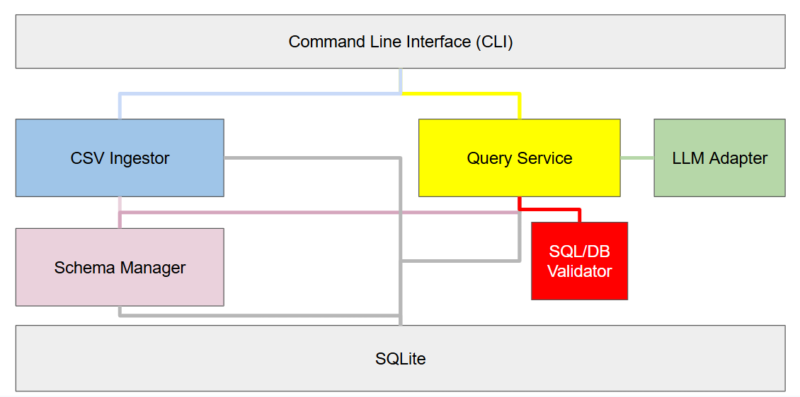

# nl2sql

A modular CLI tool for loading CSV data into SQLite and querying it using SQL or natural language.

## System Overview

`nl2sql` provides a simple pipeline for working with structured data:

- Load CSV files into a SQLite database
- Inspect tables and schema
- Run SQL queries safely
- Ask natural language questions that are translated to SQL via an LLM

All queries (manual or LLM-generated) go through the same validation layer before execution.

## System Diagram

## System Design

<p align="center">
  
</p>

The system is organized as a modular pipeline centered around the Query Service.

The CLI serves as the entry point, routing user actions either to the CSV loader for ingestion or to the query path for execution. All queries, whether written directly by the user or generated from natural language, are handled by the Query Service, which ensures a single, consistent execution path.

Natural language queries are first translated into SQL by the LLM adapter. The generated SQL is treated as untrusted input and must pass through the SQL validator before execution. This guarantees that only safe, valid queries reach the database.

The Schema Manager provides a unified view of the database structure. It is used during ingestion to determine schema compatibility and during query generation to provide context to the LLM.

SQLite acts as the storage layer, with all data access flowing through the validated query pipeline.

## Project Structure

```text
src/
├── ingestion/      # CSV loading and table creation
├── schema/         # schema inspection and comparison
├── validation/     # SQL validation
├── query/          # query execution + orchestration
├── llm/            # NL → SQL adapter (only Gemini support)
├── cli.py          # interactive CLI
├── main.py         # entry point

tests/
├── unit/           # module-level tests
└── integration/    # E2E CLI tests
```

## How to Run

### 1. Install dependencies

```bash
pip install -r requirements.txt
```

### 2. Set LLM API key

```bash
export GEMINI_API_KEY=<your_key>
```

### 3. Start CLI

```bash
python src/main.py
```

## CLI Commands

- `help`   — see all commands
- `load`   — load CSV into database  
- `tables` — list tables  
- `schema` — show schema  
- `query`  — run SQL query  
- `ask`    — natural language query  
- `exit`   — quit  

## Example

```text
> load
CSV path: employees.csv
Table name: employees

> ask
Question: show all employee names and ages
```

## How to Run Tests

Run all tests:

```bash
pytest
```

Run unit tests specifically:

```bash
pytest tests/unit
```

Run integration tests specifically:

```bash
pytest tests/integration
```

## Code Quality

This project uses:

- `flake8` for linting  
- `autopep8` for formatting  
